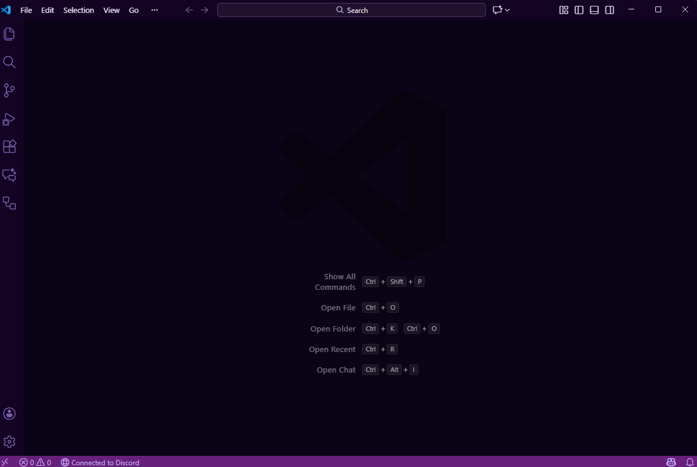

# Nyx Theme: Purple Void

A soft, cosmic dark theme for late-night coding – with subtle purples, readable contrast and matching file icons for JavaScript, TypeScript, Python, Java and more.

<p align="center">
  
</p>

---

## ✨ What you get

- **Soft purple void UI**  
  Calm, dark background with muted panel borders and accents so the code stays in focus.

- **Readable syntax highlighting**  
  - Keywords & control flow gently pop  
  - Functions and variables clearly separated  
  - Strings and template literals easy on the eyes  
  - Subtle color for comments (visible but not loud)

- **Custom file icons (Nyx File Icons)**  
  - JavaScript / JSX / TS / TSX  
  - Python  
  - Java (steaming cup)  
  - JSON / YAML / config files  
  - Folders and open folders with nebula-like gradients

- **.env friendly**  
  Environment files use a slightly brighter foreground so keys and values don't disappear into the background.

---

## 🧩 Installation

### From the VS Code Marketplace

1. Open **Extensions** (`Ctrl/Cmd + Shift + X`)
2. Search for **“Nyx Theme: Purple Void”** or `nyxar0th.nyx-purple-void`
3. Click **Install**
4. When prompted, click **Set Color Theme**

### From a `.vsix` file (manual install)

If you have a `nyx-purple-void-x.y.z.vsix` file:

1. In VS Code, open the **Command Palette** (`Ctrl/Cmd + Shift + P`)
2. Run **Extensions: Install from VSIX...**
3. Select the `.vsix` file
4. After install, choose **Nyx Theme: Purple Void** as your color theme

---

## 🎨 Activating the theme & icons

### 1. Set the color theme

1. `Ctrl/Cmd + Shift + P`
2. Type **“Color Theme”**
3. Choose **Nyx Theme: Purple Void**

### 2. Enable Nyx file icons

1. `Ctrl/Cmd + Shift + P`
2. Type **“File Icon Theme”**
3. Select **Nyx File Icons**

If the icons don’t change:

- Make sure you’re using the latest version of the extension  
- Reload VS Code (`Ctrl/Cmd + Shift + P` → **Developer: Reload Window**)  
- Re-select **Nyx File Icons**

---

## ⚙️ Optional: Recommended settings

These are totally optional, but they pair nicely with the theme:

```jsonc
// settings.json
{
  "workbench.colorTheme": "Nyx Theme: Purple Void",
  "workbench.iconTheme": "nyx-file-icons",

  // Better contrast for brackets & guides
  "editor.guides.bracketPairs": true,
  "editor.bracketPairColorization.enabled": true,

  // Subtle cursor and smooth scrolling
  "editor.cursorSmoothCaretAnimation": "on",
  "editor.smoothScrolling": true,

  // Nice line height and letter spacing
  "editor.lineHeight": 1.3,
  "editor.letterSpacing": 0.2
}
